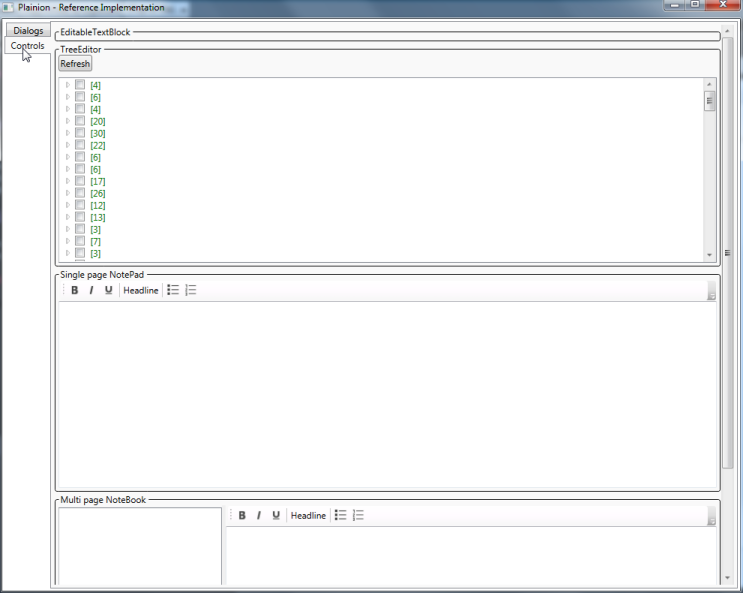

The Plainion.Windows library provides various extensions to WPF to simplify the usage 
and to extend of its concepts. 


## Plainion.Windows

- BindingProxy: see [How to bind to data when the DataContext is not inherited](http://www.thomaslevesque.com/2011/03/21/wpf-how-to-bind-to-data-when-the-datacontext-is-not-inherited/)
- PropertyBinding: allows binding of viewmodel properties with eachother to automatically "forward" changes

```C#
PropertyBinding.Bind( () => vm1.PrimaryValue, () => vm2.SecondaryValue, BindingMode.TwoWay );
```

- TaskExtensions.RethrowExceptionsInUIThread allows rethrowing exceptions from TPL tasks into the UI thread

## Plainion.Windows.Controls

- FrameworkElementAdorner/AdornedControl allow putting controls (e.g. ProgressBar) into an Adorner
- CircularProgressIndicator: simple progress indicator with details and flexible progress "numbers"
- SearchTextBox: simple search box with preview
- SelectFolderDialog wrapped to be used in WPF easily

### TreeEditor

Feature rich tree control/"editor" (see RI below)

- Drag&Drop of nodes
- In-place-Edit
- ContextMenu for create and Delete
- MVVM

### Text

- RichTextEditor
  - nicer looking bullet lists
  - various AutoCorrections
    - MarkDown headlines and bullet lists
	- ASCII to Unicode conversion
- NotePad
  - Adds toolbar with search and format buttons to the RichTextEditor
- NoteBook
  - Adds tree navigation for multiple documents and storage to the NotePad

See it in production at [Plainion.OneNote](https://plainionist.github.io/Plainion.OneNote/) (including detailed feature description).

## Plainion.Windows.Diagnosis

- WpfStatics collects and provides common memory leak pitfalls in WPF applications, e.g.:

```
Data binding to non-observable property causes memory leak
Choose one of the following options:
  a) convert to DependencyProperty
  b) implement INotifyPropertyChanged in owning type
  c) bind with BindingMode=OneTime
```

or

```
Observation of DependencyProperty using DependencyPropertyDescriptor.AddValueChanged() causes memory leak
Call DependencyPropertyDescriptor.RemoveValueChanged() to remove the event handler.
```

and more

## Plainion.Windows.Interactivity

Contains various behaviors to avoid code behind in MVVM apps, e.g.:

- FocusOnClickBehavior
- OpenLinkOnCtrlClickBehavior
- PanOnLMBBehavior
- RaisCommandOnMoueGetureBehavior

and more.

## Plainion.Windows.Interactivity.DragDrop

Provides basic and generic Drag&Drop support compatible with MVVM pattern.

- Views/ViewModels implementing IDragable can be dragged
- Views/ViewModels implementing IDropable can be drop targets
- FrameworkElementDragBehavior and FrameworkElementDropBehavior are used in the Xaml to wire up with Windows Drag&Drop events


## Plainion.RI

Use the reference implementation (Plainion.RI.exe) to play around with the extensions provided by 
this library.



